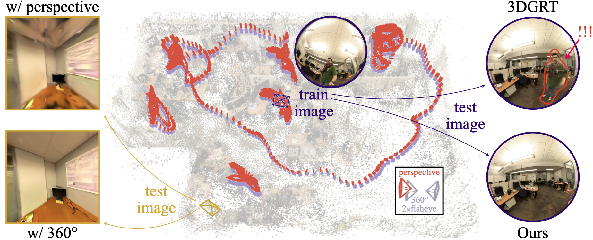

# FullCircle: Effortless 3D Reconstruction from Casual 360° Captures
[](https://theialab.github.io/fullcircle/)
[](https://arxiv.org/abs/2603.22572)
[](https://huggingface.co/datasets/youlenda/FullCircle)

[Yalda Foroutan](https://youlenda.github.io)\*,
[Ipek Oztas](https://ipekoztas.github.io)\*,
[Daniel Rebain](http://drebain.com),
[Aysegul Dundar](https://www.cs.bilkent.edu.tr/~adundar/),
[Kwang Moo Yi](https://www.cs.ubc.ca/~kmyi/),
[Lily Goli](https://lilygoli.github.io)†,
[Andrea Tagliasacchi](https://theialab.ca)†

Official implementation of **FullCircle**, a method for robust 3D reconstruction from casual 360° captures.



## Installation

### Option A: Conda (local)

```bash
git clone --recursive git@github.com:theialab/fullcircle.git
cd fullcircle
bash install_env.sh fullcircle
conda activate fullcircle
```
### Option B: Docker

```bash
git clone --recursive git@github.com:theialab/fullcircle.git
cd fullcircle
docker build -t fullcircle .
docker run --gpus all -it fullcircle bash
```


## Data

Download the dataset from [HuggingFace](https://huggingface.co/datasets/youlenda/FullCircle) and place scenes under `data/`. Each scene should be organized as follows:
```
data/<scene_name>/
├── images/              # fisheye frames (camera1/, camera2/)
├── masks/               # fisheye masks (camera1/, camera2/)
├── omni/images/         # 360° omnidirectional frames
└── sparse/0/            # COLMAP reconstruction
```
> [!NOTE]
> Remember to set the DISPLAY environment variable if you are running on a remote server from the command line.

Alternatively, use the viser GUI contributed by the community (@tangkangqi):
```bash
python train.py --config-name apps/nerf_synthetic_3dgut.yaml path=data/nerf_synthetic/lego with_viser_gui=True
```
> [!NOTE]
> Remember to install viser first via `pip install viser` and forward the port 8080 to your local machine if you are running on a remote server.


## Usage

### 1. Masking (optional)

Masks are already provided in the released data. Re-generate them with:

```bash
bash scripts/run_masking.sh <scene_name>
```

### 2. Camera calibration with COLMAP (optional)

COLMAP files are already provided in the data. Re-run calibration with:

```bash
bash scripts/run_colmap.sh <scene_name>
```

Note: COLMAP masks should invert the capturer masks and include the fisheye border (`masking/mask_train.png`); COLMAP ignores pixels where the mask is 0.

### 3. Training

```bash
python train.py \
  --config-name apps/colmap_3dgrt.yaml \
  path=data/<scene_name> \
  out_dir=runs \
  dataset.downsample_factor=4 \
  dataset.test_frame_suffix="_test"
```

### 4. Rendering

```bash
python render.py \
  --checkpoint runs/<scene_name>/ckpt_last.pt \
  --out-dir runs/<scene_name>
```

## BibTeX
```bibtex
@article{foroutan2026fullcircle,
  title   = {FullCircle: Effortless 3D Reconstruction from Casual 360° Captures},
  author  = {Foroutan, Yalda and Oztas, Ipek and Rebain, Daniel and Dundar, Aysegul and Yi, Kwang Moo and Goli, Lily and Tagliasacchi, Andrea},
  journal = {arXiv preprint arXiv:2603.22572},
  year    = {2026}
}
